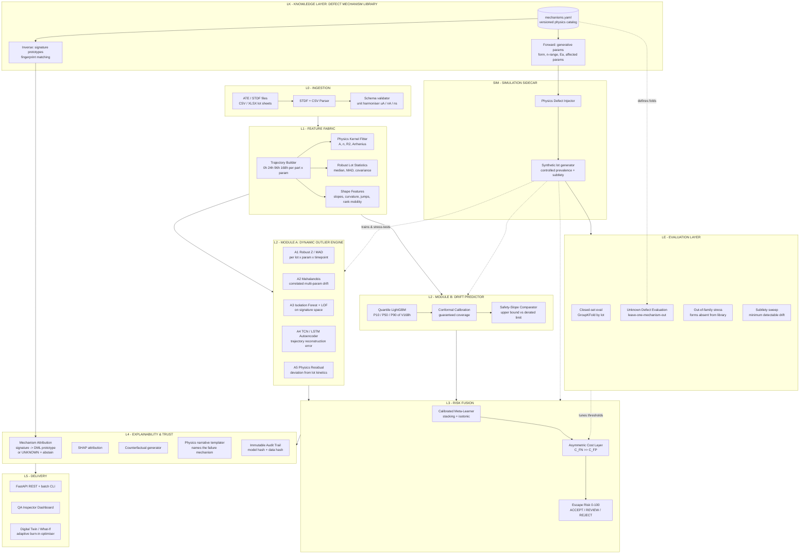

# SIH26170 — AI-Driven Anomaly Detection in Component Burn-In & Screening
## System Architecture

> **Name:** **SENTINEL-BI** — *Screening ENgine for Trajectory-Informed Elimination of Latent defects in Burn-In*

---

## 0. The core reframe (our innovation thesis)

Every naive solution treats this as *"two ML models on a table of numbers"*: an outlier detector on the columns, and a regressor `f(V0h, V24h) -> V168h`.

That throws away the physics. Burn-in is not a random walk — it is **accelerated wear-out governed by known degradation kinetics**. A healthy part and a latent-defect part differ **not in their value but in the shape of their degradation curve**.

So the central object of our system is not a *value*. It is a **Degradation Signature**: a small physics-parameterised vector fitted to each part's own time-series.

```
Classical degradation kinetics (NBTI / HCI / TDDB / ionic contamination):

    dV(t) = A * t^n         power-law drift, n ~ 0.15-0.25 for healthy parts
    A     ~ exp(-Ea / kT)   Arrhenius acceleration at 125 C

Fit per part  ->  signature  s = [ A, n, R2, residual_kurtosis, jump_count ]
```

A part sitting comfortably inside the datasheet limit but whose **fitted exponent is `n = 0.42` when its lot sits at `n = 0.18`** is a latent defect *with a physical name*: runaway leakage from a gate-oxide pinhole. That is exactly the part that escapes static screening and kills the payload in orbit.

**Four consequences — and each maps onto a scored metric:**

| Innovation | Attacks |
|---|---|
| Physics-informed signature space (PIDS) | **Anomaly score** — separates *level* outliers from *kinetic* outliers |
| Quantile + conformal prediction; reject on the **upper bound** | **False Negatives** — a bounded, *guaranteed* escape rate |
| Synthetic physics-based defect injection | The **missing-labels** problem — lets us *measure* FN at all |
| Physics-anchored counterfactual certificates | **Explainability** — the inspector reads a cause, not a SHAP bar |
| **Defect Mechanism Library** — one declarative physics catalog, read in both directions | Explainability **and** generation from a single source of truth |
| **Unknown Defect Evaluation** — leave-one-mechanism-out + open-set abstention | The *"you invented your own defects"* attack, and real-world novelty |

---

## 1. Top-level architecture



---

## 2. Layer-by-layer specification

### LK — Defect Mechanism Library (the knowledge layer)

A **versioned, declarative YAML catalog** of physical failure mechanisms. It is not a data file bolted onto the injector — it is the system's knowledge base, and it is **read in two directions**:

- **Forward (generative)** → the injector reads `physics` to *synthesise* defects.
- **Inverse (diagnostic)** → the explainer reads `fingerprint` to *name* the mechanism behind a rejection.

One artifact, two consumers, zero drift between what we generate and what we claim to diagnose. Adding a mechanism is a config commit, not a code change.

```yaml
- id: MECH-TDDB-01
  name: Gate-oxide pinhole (TDDB precursor)
  family: dielectric_breakdown
  physics:
    form: power_law_runaway        # dV = A * t^n
    n_range: [0.35, 0.65]
    A_range: [0.5, 3.0]
    activation_energy_eV: 0.7      # Arrhenius, for 125 C acceleration
  affects: [Iddq, I_leak_gate]
  fingerprint:
    n_shift_vs_lot: ">= +0.15"
    r2: ">= 0.95"
    monotonic: true
    jump_count: 0
    rank_mobility: high
  severity: critical
  reference: JEDEC JEP122 / MIL-STD-883 TM1005
  detectability: { static_limits: none, robust_z: partial, physics_residual: strong }
```

**Seed catalog (v1)**

| ID | Mechanism | Functional form | Signature tell |
|---|---|---|---|
| `MECH-TDDB-01` | Gate-oxide pinhole | power-law runaway | `n` rises sharply, R2 stays high |
| `MECH-HCI-01` | Hot-carrier injection | power law, `n ~ 0.3` | affects `t_pd` before `Iddq` |
| `MECH-NBTI-01` | NBTI threshold drift | power law, `n ~ 0.16` | *nominal* — the healthy baseline |
| `MECH-EM-01` | Electromigration | step discontinuity | CUSUM jump, R2 collapses |
| `MECH-ION-01` | Mobile-ion contamination | non-monotonic hump | recovers, monotonicity violated |
| `MECH-PKG-01` | Bond-wire / package | variance inflation | noise floor rises, no trend |
| `MECH-ESD-01` | Latent ESD damage | early offset + flat | high `A`, low `n` |
| `MECH-THERM-01` | Localised thermal runaway | exponential | spatially clustered on wafer |

**Also carried per entry:** `severity` (drives the cost weighting — not every defect costs the same), `detectability` (an honest per-track coverage map that doubles as a **coverage audit**: which mechanisms does no track catch strongly? that gap *is* the next sprint's backlog), and `reference` (cited in the certificate, so a rejection traces to a standard).

> **Honesty note, and it matters.** Because one library both generates and diagnoses, mechanism attribution is *trivially* correct on synthetic data — it would be circular to report that accuracy as a result. Attribution is only credible when validated against held-out mechanisms and real data, with a genuine `UNKNOWN` escape hatch. That is precisely what the Evaluation Layer below exists to enforce, and we state this limitation in the pitch rather than waiting for a judge to find it.

### L0 — Ingestion
| Item | Detail |
|---|---|
| Inputs | **STDF** (real ATE native format), CSV, XLSX |
| Canonical schema | `part_id, lot_id, wafer_id, x, y, param_name, unit, hours, value, limit_lo, limit_hi, temp_C` |
| Validation | Contract checks: monotonic hours, unit coherence, missing-timepoint policy, duplicate part IDs |
| Why it matters | Real fabs export STDF. Reading it makes this *deployable*, not a notebook demo — and judges notice. |

### L1 — Feature Fabric
Per `(part_id, param_name)` trajectory `{(0,v0), (24,v24), (96,v96), (168,v168)}`:

**a) Physics kernel fit** — least squares on `log(dV) = log A + n*log t`, yielding `A` (magnitude), `n` (kinetic exponent), `R2` (how well the physics explains it). A low `R2` is itself a red flag: the part is degrading by a mechanism that is **not its lot's mechanism**.

**b) Robust lot statistics** — never mean/sigma. A single 45 µA part inflates sigma and *hides itself*. Use:
```
robust_z = 0.6745 * (x - median_lot) / MAD_lot
```
computed **per lot x per parameter x per timepoint**, plus on the *deltas* (`d0->24`, `d24->96`, `d96->168`) and on the *signature* (`n`, `A`).

**c) Peer-relative spatial term** — where wafer `(x, y)` exists, compare each die against its 8-neighbour ring. Cluster defects are spatially correlated; a die anomalous against its neighbours but normal against the lot is a genuine localised process excursion.

**d) Shape features** — normalised slopes, curvature sign, monotonicity violations, CUSUM jump detection, noise floor, and **rank mobility**: did the part climb its lot's ranking between 0 h and 96 h? Rank mobility is the single strongest latent-defect tell, and almost nobody computes it.

### L2 · Module A — Dynamic Outlier Engine (five deliberately heterogeneous tracks)
| Track | Method | Catches |
|---|---|---|
| A1 | Robust Z / MAD vs lot | Level outliers — *"45 µA in a 10 µA lot"* (the brief's own example) |
| A2 | Mahalanobis on multi-param vector | Correlated drift across Iddq + leakage + t_pd |
| A3 | Isolation Forest + LOF on signature space | Novel / unseen defect geometry |
| A4 | TCN or LSTM autoencoder on the trajectory | Non-parametric weird shapes |
| A5 | Physics residual `abs(n_part - n_lot) / MAD(n_lot)` | **Kinetic** outliers — the actual escapees |

Heterogeneity is the whole point: five weak, *uncorrelated* detectors fuse into one strong detector with a far lower FN rate than any single model. Labels are scarce, so we use **PU learning / weak supervision** — treat known field failures as positives, the rest as unlabelled, and calibrate against synthetic injections.

### L2 · Module B — Drift Predictor
The brief asks for `f(V0h, V24h) -> V168h`. A **point** prediction is the wrong output for a safety decision: a mean prediction of 40 µA against a 50 µA limit conceals that the P90 is 58 µA.

```
Quantile LightGBM  ->  P10, P50, P90 of V168h
Conformal wrapper  ->  prediction interval with GUARANTEED coverage 1-alpha
Decision           ->  REJECT if UpperBound(V168h) > derated_limit
                       derated_limit = 0.8 * datasheet_max    (space derating)
Safety slope       ->  REJECT if (P90_168h - V0h)/168 > lot_slope_p99
```

Inputs: `V0h, V24h` **plus lot-relative context** (`robust_z`, lot median, lot `n`) — *contextual* regression, because the same pair of values means different things in a tight lot than in a scattered one.

Metric: MAE on `V168h` (the brief's metric) reported *alongside* interval coverage and width — accuracy **and** honesty.

### L3 — Risk Fusion & Asymmetric Cost
Stack the five Module-A scores plus the Module-B margin into a calibrated meta-learner, then pick the threshold by **expected cost, not F1**:

```
Cost(theta) = C_FN * P(escape | theta) + C_FP * P(false alarm | theta)
C_FN : C_FP  ~  1000 : 1        a lost satellite vs a $40 component

theta* = argmin_theta E[Cost(theta)]
```

Output is a **three-band decision**, because that is how QA actually works:

`ACCEPT (0-30)` · `REVIEW (30-70)` · `REJECT (70-100)`

The REVIEW band is where FN risk goes to die — ambiguous parts get human eyes instead of a coin flip.

### L4 — Explainability (the metric most teams will lose)
Four ascending layers:
0. **Mechanism attribution** — match the part's fitted signature against the DML prototypes (Mahalanobis distance in fingerprint space). If the nearest prototype is within threshold `tau`, the certificate names it. If **no** prototype is within `tau`, the part is labelled `UNKNOWN-MECHANISM` and **forced into the REVIEW band — never ACCEPT**. Abstention beats a confident wrong label: "anomalous, mechanism unrecognised" is an honest and actionable output for a QA inspector, and it is the correct behaviour for a defect physics nobody has catalogued yet.
1. **SHAP** — per-decision feature attribution.
2. **Counterfactual** — the actionable one: *"had V24h been <= 13.5 µA, this part would have passed"*.
3. **Physics narrative** — a templated, mechanism-named paragraph:

> **Part `LOT7-W3-D0412` — REJECT · Escape Risk 87/100**
>
> Standby current `Iddq` measured **18.2 µA at 24 h**, sitting **6.4 MAD above its lot median (10.1 µA)** though comfortably inside the 50 µA datasheet maximum. Its fitted degradation exponent is **n = 0.42 against a lot n = 0.18** (R2 = 0.99) — superlinear runaway consistent with a **gate-oxide pinhole (TDDB precursor)**. Conformal forecast at 168 h: **P50 = 48 µA, P90 = 62 µA**; the upper bound exceeds the derated limit of 40 µA. Two lot-mates share the same signature at adjacent wafer coordinates, suggesting a localised process excursion.
>
> *Drivers: kinetic exponent 41 % · rank mobility 22 % · robust-Z 19 %*
> *Counterfactual: pass requires V24h <= 13.5 µA and n <= 0.26*
> *Audit: model `sha256:a19f...` · data `sha256:7c02...` · 2026-09-30T14:02Z*

That final block — the **immutable audit trail** — is what makes the system usable under ECSS / MIL-STD-883 quality regimes: deterministic, versioned, replayable.

### L5 — Delivery
- **FastAPI**: `POST /score/lot`, `POST /predict/drift`, `GET /explain/{part_id}`, `GET /report/{lot_id}`
- **Dashboard**: lot heatmap, spaghetti trajectory plot with anomalies highlighted, wafer map, per-part certificate, cost/confusion panel.
- **Digital Twin / What-If console** — the ROI story: *"extend burn-in to 240 h -> 3 more escapes caught, +$8k cost"*; and **Adaptive Burn-In**, stopping early at 96 h for the ~82 % of parts already confidently clean and extending only the uncertain tail. Same safety, less oven time. This is what turns a detector into a *product*.

### SIM — Physics Defect Injector (our unfair advantage)
Nobody hands us a labelled latent-defect dataset, so we **build the ground truth we are scored against**:

| Injected mechanism | Signature |
|---|---|
| Gate-oxide pinhole (TDDB) | superlinear, `n` rises, exponential tail |
| Electromigration | step discontinuity mid burn-in |
| Ionic contamination | recoverable hump, non-monotonic |
| Bond-wire / package | variance inflation, noisy trajectory |
| Healthy | `n ~ 0.18`, high `R2`, low rank mobility |

Injected at controlled prevalence (0.5 %, 1 %, 5 %) and controlled *subtlety*, with every defect kept **inside** the static limits. This gives us an **FN-rate vs defect-subtlety curve** — a plot no other team will have, and the single most persuasive slide in the deck.

---

## 3. Tech stack
| Layer | Choice |
|---|---|
| Core | Python 3.11, numpy, pandas, polars |
| Ingest | `pystdf`, pandera |
| Models | scikit-learn, LightGBM (quantile objective), PyTorch (TCN-AE), MAPIE (conformal) |
| Explain | SHAP, DiCE (counterfactuals), Jinja2 (narrative) |
| Store | DuckDB (dev) -> TimescaleDB / Postgres (prod) |
| API | FastAPI + Pydantic v2 + Uvicorn |
| UI | Streamlit for speed -> Next.js + Recharts if time allows |
| MLOps | MLflow registry, deterministic seeds, model + data hashing |
| Ship | Docker Compose, pytest, GitHub Actions |

---

## 4. Repository layout
```
Ai_Driven_anomaly_det/
├─ docs/           ARCHITECTURE.md · PLAN.md · METRICS.md
├─ configs/        lot_rules.yaml · costs.yaml · model_params.yaml
│  └─ mechanisms/  mechanisms.v1.yaml   <- the Defect Mechanism Library
├─ data/           raw/ processed/ synthetic/
├─ src/
│  ├─ ingest/      stdf_reader.py · csv_reader.py · validate.py
│  ├─ features/    trajectory.py · physics_kernel.py · robust_stats.py · shape.py
│  ├─ module_a/    robust_z.py · mahalanobis.py · iforest.py · tcn_ae.py · physics_residual.py
│  ├─ module_b/    quantile_gbm.py · conformal.py · safety_slope.py
│  ├─ fusion/      meta_learner.py · cost_decision.py
│  ├─ explain/     shap_explainer.py · counterfactual.py · narrative.py · audit.py
│  ├─ knowledge/   library.py · schema.py · prototypes.py · coverage_audit.py
│  ├─ simulate/    defect_injector.py · lot_generator.py · out_of_family.py
│  ├─ eval/        harness.py · unknown_defect.py · subtlety_sweep.py · explain_metrics.py
│  └─ api/         main.py · schemas.py
├─ dashboard/      app.py
├─ notebooks/      01_eda · 02_module_a · 03_module_b · 04_eval
└─ tests/
```

---

## 5. Evaluation protocol (mapped directly onto the three scored metrics)

**Anomaly Detection Score — FN is catastrophic**
- Primary: **Recall @ fixed FPR**, and **F-beta with beta = 5** (weights recall 25x over precision).
- Report **PR-AUC**, not ROC-AUC — ROC-AUC lies at 1 % prevalence.
- Report the **expected-cost curve** vs threshold at `C_FN/C_FP = 1000`.
- Report the **FN vs defect-subtlety curve** from the injector.
- Validation: **GroupKFold by `lot_id`** — never split a lot across folds, that leaks the lot statistics and inflates every score — plus a held-out future lot.

**Unknown Defect Evaluation (LE) — the credibility firewall**

A judge's first and best attack is: *"you generated your own defects, so of course you detect them."* This protocol answers it with numbers rather than argument. Four tiers, increasing in severity:

| Tier | Protocol | Question it answers |
|---|---|---|
| **UDE-1 · Leave-one-mechanism-out** | For each mechanism `m` in the DML, train and calibrate on all mechanisms *except* `m`, then evaluate recall on `m` alone | Does the detector generalise to a defect physics it has never seen? |
| **UDE-2 · Out-of-family stress** | Inject defects from functional forms **deliberately absent** from the library — stretched exponential `exp(-(t/tau)^beta)`, log-time, sigmoidal saturation, intermittent telegraph noise | Are we detecting *anomaly*, or merely recognising our own parametric form? |
| **UDE-3 · Open-set / abstention** | Measure AUROC for known-vs-unknown mechanism separation, plus the abstention rate and its precision | Does the system know what it doesn't know? |
| **UDE-4 · Subtlety sweep** | Scale defect magnitude down until detection fails; report **Minimum Detectable Drift (MDD)** in lot-MAD units | What is our sensitivity floor, as a spec number? |

Reporting rules, both non-negotiable:
- **Report the worst-case mechanism, not the mean.** A system that averages 94 % recall while missing electromigration entirely is a system that loses satellites to electromigration. The headline number is the minimum of the LOMO table.
- **UDE-1 recall is the honest headline metric**, not closed-set recall. Closed-set numbers are reported alongside, clearly labelled as optimistic.

Deliverables: the **LOMO table** (per-mechanism generalisation), the **MDD curve**, and the **coverage-audit matrix** from the DML `detectability` fields. Together these three artifacts are the strongest evidence in the entire submission — and UDE-2 in particular is what separates a detector from a pattern-matcher.

**Drift Prediction Accuracy**
- MAE and MedAE on `V168h`, per parameter, and **separately on the defective subset** (accuracy where it actually matters).
- Plus interval **coverage** (should land on 1-alpha) and **mean interval width**.
- Baselines to beat, published openly: last-value-carry-forward, linear extrapolation from `V0->V24`, plain ridge. Publishing baselines buys credibility.

**Explainability**
- Every decision ships a certificate: SHAP + counterfactual + named mechanism + audit hash.
- **Faithfulness**: deletion/insertion test on top-k features.
- **Stability**: SHAP rank correlation under bootstrap >= 0.85.
- Human proxy: a 5-question QA-inspector comprehension check across 10 sample certificates.
